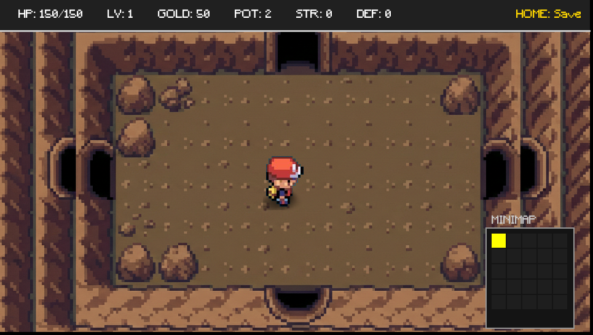
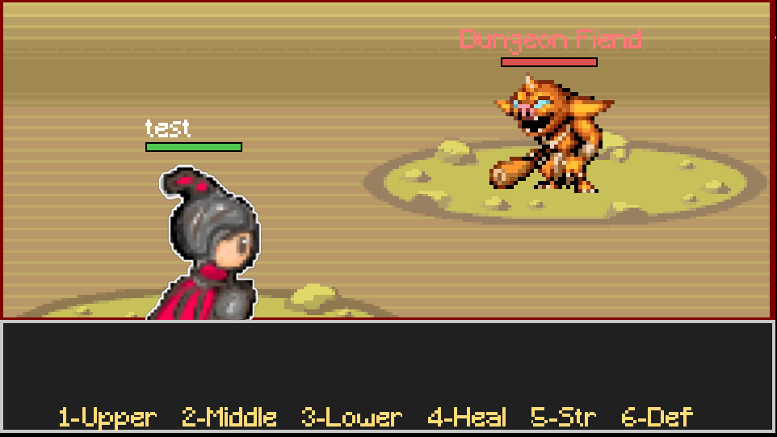
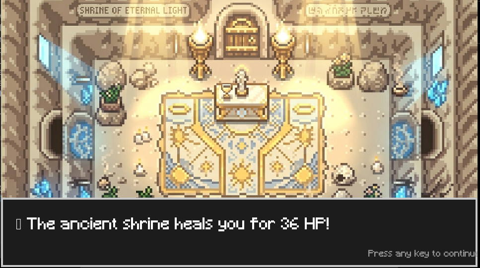
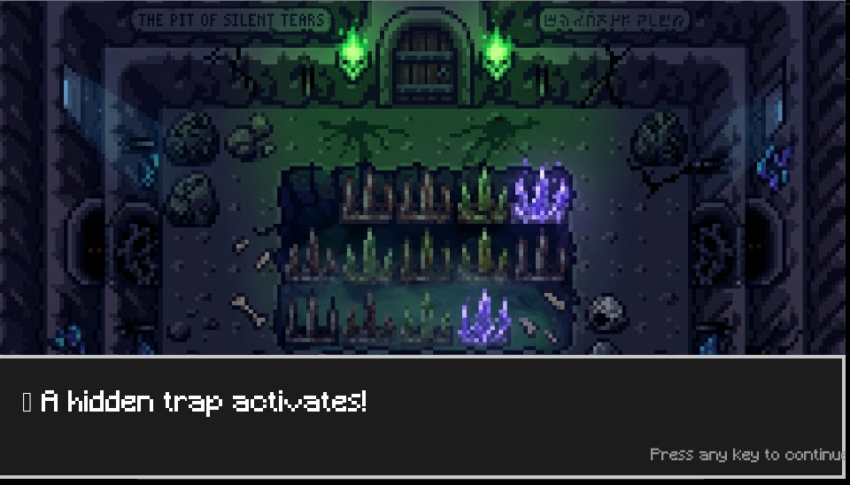

# 🏰 Dungeon Adventure RPG

A visually immersive, turn-based RPG built with **Pygame**. Explore a procedural dungeon, level up your hero, and face off against the powerful Dungeon Lord.

---

## Visit the website!
   Visit the all new website for more info
   https://funnykid7.github.io/dungeon-adventure-rpg/

---

## 📸 Showcase
| | |
|---|---|
|  |  |
|  |  |

---

## Features
- **6 Playable Classes**: Warrior, Mage, Rogue, Paladin, Ranger, and Monk—each with unique passives and stats.
- **Dynamic Combat**: A turn-based system featuring critical hits, combos, and healing.
- **Overworld Exploration**: Move through rooms to find enemies, merchants, traps, or shrines.
- **Merchant System**: Spend gold on potions and powerful weapons like the *Royal Claymore*.
- **Save/Load System**: Continue your adventure later with persistent save files.
- **Project Evolution**: This project preserves its full development history, from text-based CLI to a graphical Pygame experience.

---

## 🕹️ Controls

### Overworld
- **WASD / Arrow Keys**: Move through the dungeon.

### Combat
- **1 / 2 / 3**: Upper, Middle, and Lower attacks.
- **4**: Use Healing Potion (Restore 40 HP).
- **5**: Use Strength Potion (1.5x damage for 5 turns).
- **6**: Use Defense Potion (Reduced damage for 5 turns).

---

## 🛠️ Installation & Setup

1. **Prerequisites**: Make sure you have [Python 3](https://www.python.org/) installed.
2. **Clone the repository** (or download the files by clicking code - download as zip).
3. **Install Dependencies**:
   ```bash
   pip install -r requirements.txt
   ```
4. **Run the Game**:
   ```bash
   python main.py
   ```

---

##  Project History (Legacy)
The `legacy/` directory contains the evolutionary steps of this project:
- **`Revision_1/`**: The original text-based CLI versions of the game. Focuses purely on core RPG logic.
- **`Revision_2/`**: Added the first audio tracks and refined the class system passives.
- **`main.py` (Revision 3)**: The current, fully graphical Pygame version.

---

##  Disclaimer
**Incomplete Development** This project aims to give a complete and distinct rpg experience. But some features and graphical elements arent fully implemented. If anyone has suggestions please send an email or a pull request. 

**Pokemon Assets**: This project currently uses a small number of sound and sprite assets from *Pokemon LeafGreen* (Nintendo/The Pokémon Company) for placeholder purposes. These assets are **not** for commercial use. If you plan to redistribute this game widely, please replace these with open-source alternatives.

---

##  License
This project is licensed under the MIT License—feel free to use it for your own learning and development!
